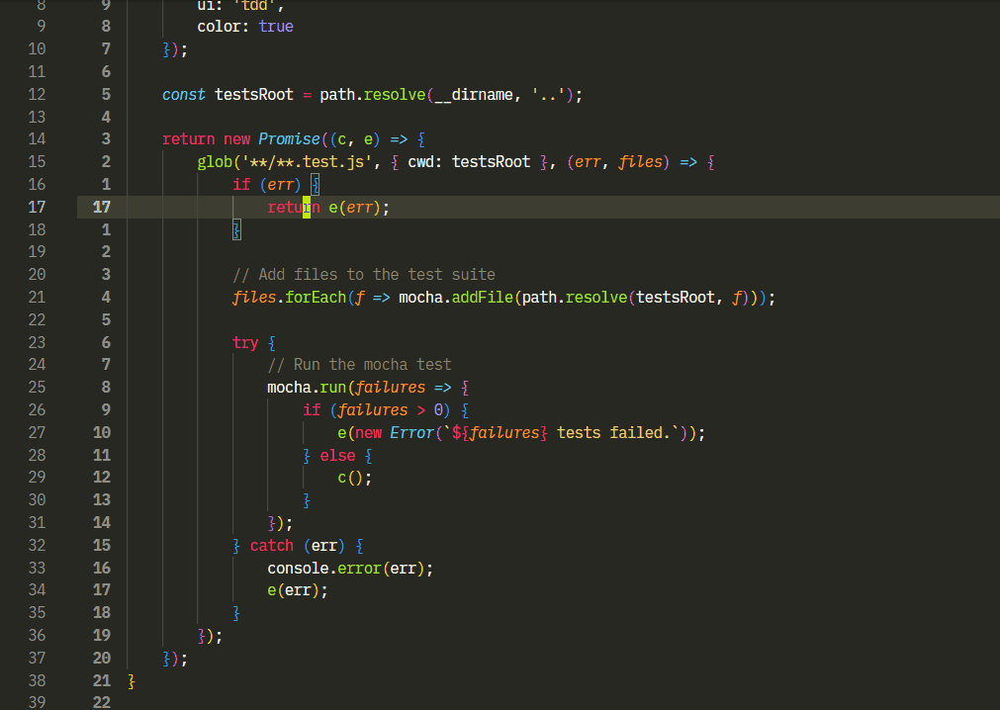
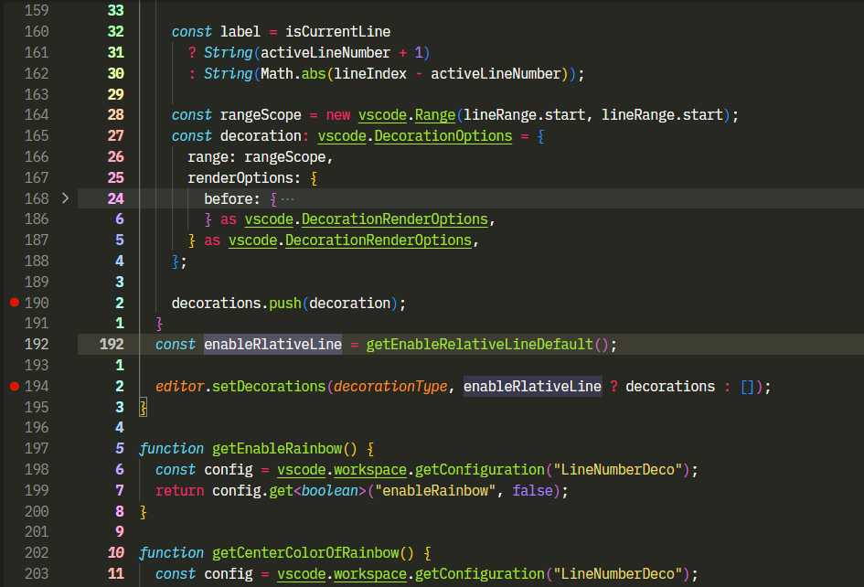

# LineNumberDeco

LineNumberDeco is a Visual Studio Code extension.
Adds relative line numbers to Visual Studio Code with decorations.
This is useful if you are using one of the Vim or Vim like plugins.

The relative line number can be displayed with only the standard function of vscode. However, when doing pair programming using liveshare or  face-to-face, it is easier to communicate if absolute line numbers are displayed. This extension is useful when you want to display both absolute and relative line numbers.

This extension has not anoying for testrunners or debuggers.

## Recommended Usage

Use with these recomended plugins.

- [VSCode Neovim](https://marketplace.visualstudio.com/items?itemName=asvetliakov.vscode-neovim)
- [VSCode Vim](https://marketplace.visualstudio.com/items?itemName=vscodevim.vim)
- [VSpaceCode](https://marketplace.visualstudio.com/items?itemName=VSpaceCode.vspacecode)
- [Neovim UI Modifier](https://marketplace.visualstudio.com/items?itemName=JulianIaquinandi.nvim-ui-modifier)

## Features

Show relative line numbers

## Requirements

none.

## Extension Settings

- `LineNumberDeco.enableRlativeLineOnDefault`: Enable display relative line on vscode startup
- `LineNumberDeco.activeForeground`: Override color of active relative line number
- `LineNumberDeco.foreground`: Override color of inactive relative line number
- `LineNumberDeco.centerColorOfRainbow`: Center color of rainbow
- `LineNumberDeco.enableRainbow`: Enable rainbow color

## Extension Commands

- `line-number-doco.enableRelativeLineNumbers`: Enable Relative Line Numbers in This workspace
- `line-number-doco.enableRelativeLineNumbersGlobal`: Enable Relative Line Numbers for User
- `line-number-doco.disableRelativeLineNumbers`: Disable Relative Line Numbers in This workspace
- `line-number-doco.disableRelativeLineNumbersGlobal`: Disable Relative Line Numbers for User

## Known Issues

none.

## Inspired

Thank you for pioneering

- [Double line numbers](https://marketplace.visualstudio.com/items?itemName=slhsxcmy.vscode-double-line-numbers)
- [Relative line numbers](https://marketplace.visualstudio.com/items?itemName=extr0py.vscode-relative-line-numbers)

## License

MIT License

## Release Notes

### 0.0.1

first release

### 0.0.2

add color option

### 0.0.3

add rainbow color
