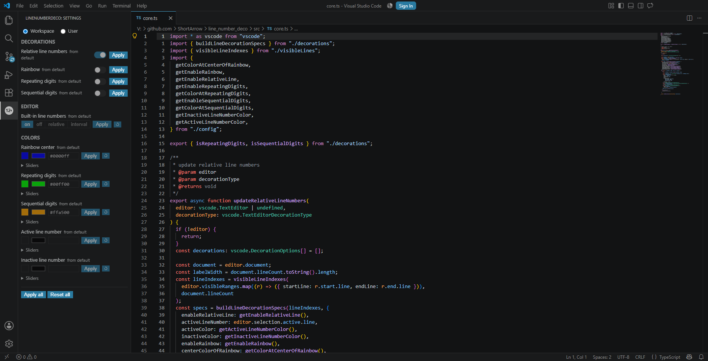

# LineNumberDeco

[](https://marketplace.visualstudio.com/items?itemName=ShortArrow.line-number-deco)
[](https://github.com/ShortArrow/line_number_deco/blob/main/LICENSE)
[](https://github.com/ShortArrow/line_number_deco/pulls)

[](https://open-vsx.org/extension/shortarrow/line-number-deco/)
[](https://open-vsx.org/extension/shortarrow/line-number-deco/)

LineNumberDeco is a Visual Studio Code extension that adds relative line numbers as editor decorations. It is useful if you use one of the Emacs or Vim like plugins.

VS Code can already show relative line numbers on its own, but it shows them instead of the absolute ones. During pair programming over Live Share or face to face, an absolute line number is the one you can say out loud. This extension displays both at once.

The decorations do not get in the way of a test runner or a debugger, because they do not cover the gutter icons for breakpoints, test starts or test results.

## Features

Relative line numbers appear beside the absolute ones, following the cursor as it moves.


Four optional decorations color the numbers further. The rainbow colors each number by its distance from the cursor. Repeating digits gives numbers whose digits all repeat (11, 22, 333) their own color. Sequential digits does the same for runs of consecutive digits (123, 543, 10). Diagnostics paints the numbers of lines carrying an error or a warning.

## Settings panel



The LineNumberDeco icon in the activity bar opens a panel for every setting of this extension, and for `editor.lineNumbers` itself. Changes preview in the editor at once; nothing is saved until Apply. The radio at the top picks the scope you are editing, and the scope the rows show. Closing the panel discards anything unapplied.

## Settings

Relative line numbers are on by default and use your theme's colors. Each decoration from the Features section has an enable key (`enableRainbow`, `enableRepeatingDigits`, `enableSequentialDigits`, `enableDiagnostics`) and a color key beside it.

Every key, with types and defaults: [docs/settings.md](docs/settings.md).

The color settings show a color picker when edited in `settings.json`.

## Commands

Everything the panel does is also a palette command, named on one pattern: `LineNumberDeco: Enable/Disable <decoration> for workspace|for user` and `LineNumberDeco: Update color of <decoration> for workspace|for user`. For example:

- `LineNumberDeco: Enable rainbow for workspace`
- `LineNumberDeco: Toggle settings panel`

The ids matter only for keybindings and `init.lua`; every id and title is in [docs/commands.md](docs/commands.md).

## Calling commands from init.lua

With [VSCode Neovim](https://marketplace.visualstudio.com/items?itemName=asvetliakov.vscode-neovim), any command from [docs/commands.md](docs/commands.md) can be called from Lua:

```lua
vim.fn.VSCodeNotify('line-number-deco.enableRainbow')
```

For example, bound to a key:

```lua
vim.keymap.set('n', '<leader>lr', function()
  vim.fn.VSCodeNotify('line-number-deco.enableRainbow')
end)
```

## Using VS Code's own relative numbers

Setting `editor.lineNumbers` to `relative` needs no extension at all, and it replaces the absolute numbers with relative ones. This extension exists for the case where you want both at once, so it leaves `editor.lineNumbers` on `on` and draws its own numbers beside VS Code's.

```json
{
    // ... other settings
    "editor.lineNumbers": "on" // or "relative" or "off" or "interval", "on" is default
    // ... other settings
}
```

Setting it to `off` leaves only this extension's numbers in the editor. The settings panel writes this same key, if you would rather pick it there.

## Recommended companions

Use with these recommended plugins.

- [VSCode Neovim](https://marketplace.visualstudio.com/items?itemName=asvetliakov.vscode-neovim)
- [VSCode Vim](https://marketplace.visualstudio.com/items?itemName=vscodevim.vim)
- [Helix For VS Code](https://marketplace.visualstudio.com/items?itemName=jasew.vscode-helix-emulation)
- [Awesome Emacs Keymap](https://marketplace.visualstudio.com/items?itemName=tuttieee.emacs-mcx)
- [VSpaceCode](https://marketplace.visualstudio.com/items?itemName=VSpaceCode.vspacecode)
- [Neovim UI Modifier](https://marketplace.visualstudio.com/items?itemName=JulianIaquinandi.nvim-ui-modifier)

## Inspired

Thank you for pioneering

- [Double line numbers](https://marketplace.visualstudio.com/items?itemName=slhsxcmy.vscode-double-line-numbers)
- [Relative line numbers](https://marketplace.visualstudio.com/items?itemName=extr0py.vscode-relative-line-numbers)

## Development

Building, testing, packaging and cutting a release are in [docs/development.md](docs/development.md); the decisions behind the toolchain and the pipeline are in [docs/adr/](docs/adr/).

## License

MIT License
