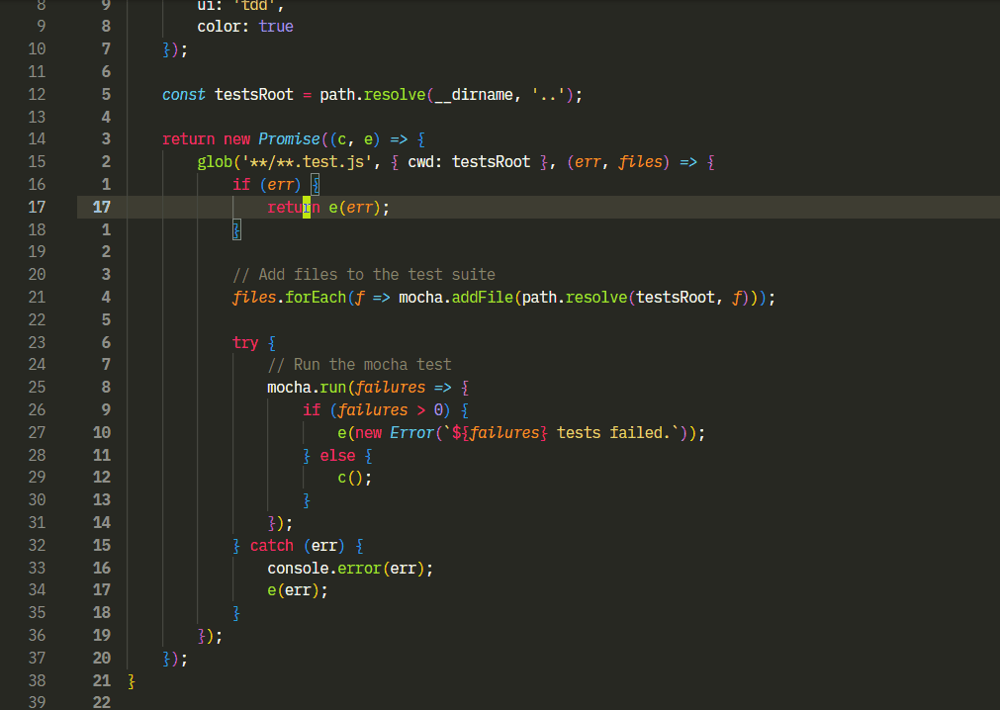
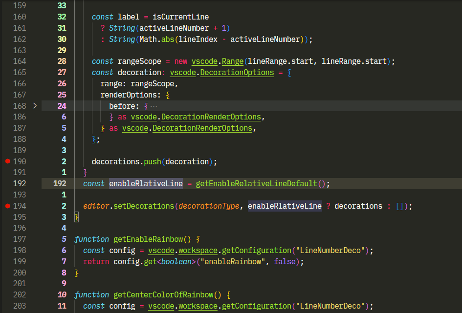

# LineNumberDeco

[](https://marketplace.visualstudio.com/items?itemName=ShortArrow.line-number-deco)
[](https://github.com/ShortArrow/line_number_deco/blob/main/LICENSE)
[](https://github.com/ShortArrow/line_number_deco/pulls)

[](https://open-vsx.org/extension/shortarrow/line-number-deco/)
[](https://open-vsx.org/extension/shortarrow/line-number-deco/)

LineNumberDeco is a Visual Studio Code extension.
Adds relative line numbers to Visual Studio Code with decorations.
This is useful if you are using one of the Emacs or Vim like plugins.

The relative line number can be displayed with only the standard function of vscode. However, when doing pair programming using liveshare or  face-to-face, it is easier to communicate if absolute line numbers are displayed. This extension is useful when you want to display both absolute and relative line numbers.

This extension has not anoying for testrunners or debuggers.
Because, it does not block the display of breakpoint icons, test start icons, test result icons, etc.

## Recommended Usage

Use with these recomended plugins.

- [VSCode Neovim](https://marketplace.visualstudio.com/items?itemName=asvetliakov.vscode-neovim)
- [VSCode Vim](https://marketplace.visualstudio.com/items?itemName=vscodevim.vim)
- [Helix For VS Code](https://marketplace.visualstudio.com/items?itemName=jasew.vscode-helix-emulation)
- [Awesome Emacs Keymap](https://marketplace.visualstudio.com/items?itemName=tuttieee.emacs-mcx)
- [VSpaceCode](https://marketplace.visualstudio.com/items?itemName=VSpaceCode.vspacecode)
- [Neovim UI Modifier](https://marketplace.visualstudio.com/items?itemName=JulianIaquinandi.nvim-ui-modifier)

## Features

Show relative line numbers



## Settings

Relative line numbers are on by default and use your theme's colors. Two decorations can be layered on top: `enableRainbow` colors each number by its distance from the cursor, and `enableRepeatingDigits` gives numbers whose digits all repeat (11, 22, 333) their own color. `enableSequentialDigits` does the same for runs of consecutive digits (123, 543, 10).

| Setting | Type | Default | Description |
| --- | --- | --- | --- |
| `LineNumberDeco.enableRelativeLine` | boolean | `true` | Enable display relative line |
| `LineNumberDeco.enableRainbow` | boolean | `false` | Enable rainbow color |
| `LineNumberDeco.centerColorOfRainbow` | color | `#0000ff` | Center color of rainbow |
| `LineNumberDeco.enableRepeatingDigits` | boolean | `false` | Enable color of repeating digits |
| `LineNumberDeco.foregroundColorOfRepeatingDigits` | color | `#00ff00` | Foreground color of Repeating digits |
| `LineNumberDeco.enableSequentialDigits` | boolean | `false` | Enable color of sequential digits (poker straights like 123 or 543) |
| `LineNumberDeco.foregroundColorOfSequentialDigits` | color | `#ffa500` | Foreground color of sequential digits |
| `LineNumberDeco.activeForeground` | color | (theme color) | Override color of active relative line number |
| `LineNumberDeco.foreground` | color | (theme color) | Override color of inactive relative line number |

The color settings show a color picker when edited in `settings.json`.

## Commands

The `ForUser` variants write to your user settings; the others write to the current workspace.

| Command | Title |
| --- | --- |
| `line-number-deco.enableRelativeLineNumbers` | LineNumberDeco: Enable Relative Line Numbers in This workspace |
| `line-number-deco.disableRelativeLineNumbers` | LineNumberDeco: Disable Relative Line Numbers in This workspace |
| `line-number-deco.enableRelativeLineNumbersForUser` | LineNumberDeco: Enable Relative Line Numbers for user |
| `line-number-deco.disableRelativeLineNumbersForUser` | LineNumberDeco: Disable Relative Line Numbers for user |
| `line-number-deco.enableRainbow` | LineNumberDeco: Enable rainbow for workspace |
| `line-number-deco.disableRainbow` | LineNumberDeco: Disable rainbow for workspace |
| `line-number-deco.enableRainbowForUser` | LineNumberDeco: Enable rainbow for user |
| `line-number-deco.disableRainbowForUser` | LineNumberDeco: Disable rainbow for user |
| `line-number-deco.updateColorAtCenterOfRainbow` | LineNumberDeco: Update color at center of rainbow for workspace |
| `line-number-deco.updateColorAtCenterOfRainbowForUser` | LineNumberDeco: Update color at center of rainbow for user |
| `line-number-deco.updateColorAtActiveRowNumber` | LineNumberDeco: Update color at current row number |
| `line-number-deco.updateColorAtActiveRowNumberForUser` | LineNumberDeco: Update color at current row number for user |
| `line-number-deco.updateColorAtInactiveRowNumber` | LineNumberDeco: Update color at inactive row number |
| `line-number-deco.updateColorAtInactiveRowNumberForUser` | LineNumberDeco: Update color at inactive row number for user |
| `line-number-deco.enableRepeatingDigits` | LineNumberDeco: Enable repeating digits in this workspace |
| `line-number-deco.disableRepeatingDigits` | LineNumberDeco: Disable repeating digits color in this workspace |
| `line-number-deco.enableRepeatingDigitsForUser` | LineNumberDeco: Enable repeating digits color for user |
| `line-number-deco.disableRepeatingDigitsForUser` | LineNumberDeco: Disable repeating digits color for user |
| `line-number-deco.updateColorAtRepeatingDigits` | LineNumberDeco: Update color of repeating digits for workspace |
| `line-number-deco.updateColorAtRepeatingDigitsForUser` | LineNumberDeco: Update color of repeating digits for user |
| `line-number-deco.enableSequentialDigits` | LineNumberDeco: Enable sequential digits in this workspace |
| `line-number-deco.disableSequentialDigits` | LineNumberDeco: Disable sequential digits color in this workspace |
| `line-number-deco.enableSequentialDigitsForUser` | LineNumberDeco: Enable sequential digits color for user |
| `line-number-deco.disableSequentialDigitsForUser` | LineNumberDeco: Disable sequential digits color for user |
| `line-number-deco.updateColorAtSequentialDigits` | LineNumberDeco: Update color of sequential digits for workspace |
| `line-number-deco.updateColorAtSequentialDigitsForUser` | LineNumberDeco: Update color of sequential digits for user |
| `line-number-deco.showSettingsPanel` | LineNumberDeco: Show settings panel |
| `line-number-deco.hideSettingsPanel` | LineNumberDeco: Hide settings panel |
| `line-number-deco.toggleSettingsPanel` | LineNumberDeco: Toggle settings panel |

## Settings panel

The LineNumberDeco entry in the activity bar opens a panel with a switch for each decoration above every color setting with its saved value and a color picker. Flipping a switch and dragging a picker both preview in the open editors without saving anything, and the row is marked until it is saved. The Apply beside a row saves that one setting; Apply all at the bottom saves everything still pending. Either writes to the workspace or to your user settings, whichever the radio at the top selects. Closing the panel discards every preview that was not applied. Each color row also expands into HSL or RGB sliders, which update the preview exactly as the picker does.

## Calling commands from init.lua

With [VSCode Neovim](https://marketplace.visualstudio.com/items?itemName=asvetliakov.vscode-neovim), any of the commands above can be called from Lua:

```lua
vim.fn.VSCodeNotify('line-number-deco.enableRainbow')
```

For example, bound to a key:

```lua
vim.keymap.set('n', '<leader>lr', function()
  vim.fn.VSCodeNotify('line-number-deco.enableRainbow')
end)
```

## Inspired

Thank you for pioneering

- [Double line numbers](https://marketplace.visualstudio.com/items?itemName=slhsxcmy.vscode-double-line-numbers)
- [Relative line numbers](https://marketplace.visualstudio.com/items?itemName=extr0py.vscode-relative-line-numbers)

## VSCode Embedded Configuration

If you want not to use this extension, you can use vscode embedded configuration.
`editor.lineNumbers` to `relative` then you can use relative line numbers.

```json
{
    // ... other settings
    "editor.lineNumbers": "on" // or "relative" or "off" or "interval", "on" is default
    // ... other settings
}
```

Or you can use `editor.lineNumbers` to `off`.
Then only show line numbers in your vscode by this extension.

## License

MIT License

## Road Map

- More faster!!!
- More variations to the decoration
